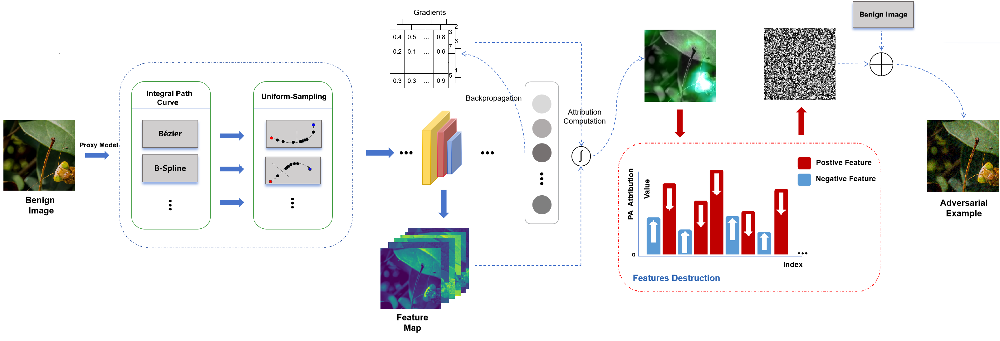

# PTNAA: Neuron-based Attribution Attack with Path Tuning

This repository contains the code for the paper: [Improving the Transferability of Adversarial Examples with Path Tuning]()



## Requirements

- Python 3.6.8
- Keras 2.2.4
- Tensorflow 1.14.0
- Numpy 1.16.2
- Pillow 6.0.0

## Folder structure

```text
├─adv
│  └─PTNAA
├─dataset
│  └─images
├─dmbp
│  └─utils
├─models_tf
└─nets
```

### adv

This folder is used to save adversarial examples. Please use `different ` file names to differentiate between different experimental setups.

### dataset

This folder saves the original benign examples and their corresponding labels. Since the actual images are not stored in this repository, please make sure you have downloaded the required files before running the code. For specific download and conversion code, please refer to the `README.md ` file in this folder.

### dmbp

We provide the visualization code of the dmbp attribution graph in this folder. For usage, please refer to the `README.md` file in this folder.

### models_tf and nets

Different network tensorflow implementations are saved here.

## Experiments

#### Introduction

- `PTNAA.py` : the implementation for PTNAA attack.


- `NAA.py` : the implementation for NAA attack.

- `attacks.py` : the implementation for PTNAA attack and baseline attacks (NRDM, FDA, FIA, NAA).

- `verify.py` : the code for evaluating generated adversarial examples on different models.

#### Layer setting

- `inception_v3`: InceptionV3/InceptionV3/Mixed_5b/concat
- `inception_v4`: InceptionV4/InceptionV4/Mixed_5e/concat
- `inception_resnet_v2`: InceptionResnetV2/InceptionResnetV2/Conv2d_4a_3x3/Relu
- `resnet_v2_152`: resnet_v2_152/block2/unit_8/bottleneck_v2/add
- `vgg_16`: vgg_16/conv3/conv3_3/Relu
- `vgg_19`: vgg_19/conv3/conv3_3/Relu

#### Example Usage

##### Generate adversarial examples:

- PTNAA

```
python PTNAA.py --model_name inception_v3 --attack_method NAA --layer_name InceptionV3/InceptionV3/Mixed_5b/concat --path B_spline --ens 30 --output_dir ./adv/PTNAA/
```

- PTNAA-PD

```
python PTNAA.py --model_name inception_v3 --attack_method NAAPIDI --layer_name InceptionV3/InceptionV3/Mixed_5b/concat --path B_spline --ens 30 --amplification_factor 2.5 --gamma 0.5 --Pkern_size 3 --prob 0.7 --output_dir ./adv/PTNAAPIDI/
```

- PIM:

```
python PTNAA.py --model_name inception_v3 --attack_method PIM --amplification_factor 2.5 --gamma 0.5 --Pkern_size 3 --output_dir ./adv/PIM/
```

- NRDM

```
python attacks.py --model_name inception_v3 --attack_method NRDM --layer_name InceptionV3/InceptionV3/Mixed_5b/concat --output_dir ./adv/NRDM/
```

Attack methods have different parameter setting for different source models, and the detailed setting can be found in our paper.

##### Evaluate the attack success rate

```
python verify.py --ori_path ./dataset/images/ --adv_path ./adv/NAA/ 
```

## Citing this work

If you find this work is useful in your research, please consider citing:

## Acknowledgments

Code refer to: [Feature Importance-aware Attack](https://github.com/hcguoO0/FIA) and [Attribution Map Generation with Disentangled Masked Backpropagation](https://gitlab.com/adriaruizo/dmbp_iccv21)